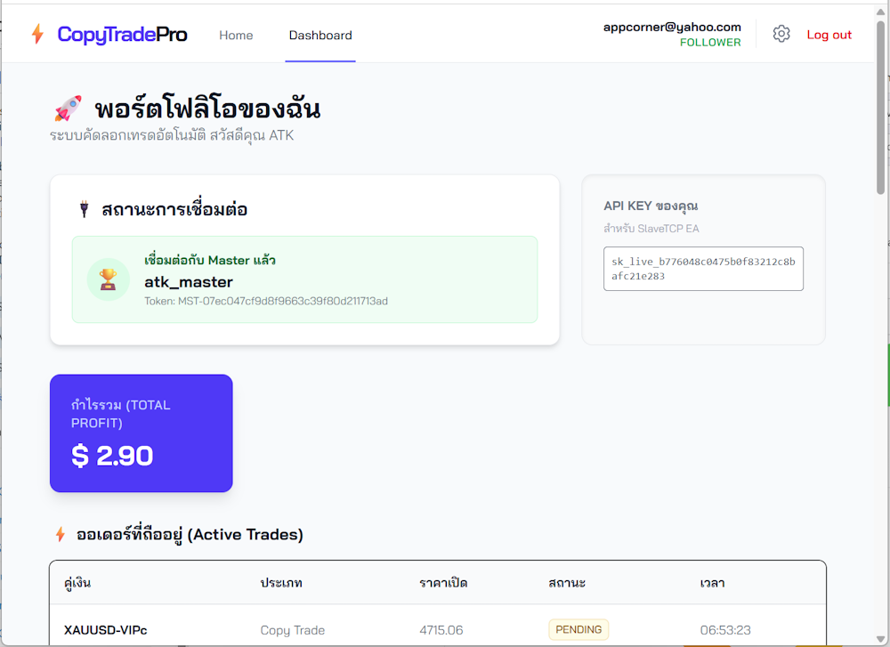

# ⚡ CopyTradePro (Real-time Copy Trading System)

**CopyTradePro** คือระบบ Copy Trade ประสิทธิภาพสูงที่พัฒนาด้วย **Elixir Phoenix** และ **MQL5** ออกแบบมาเพื่อลดความล่าช้า (Latency) ในการส่งสัญญาณเทรดด้วยการเชื่อมต่อแบบ **TCP Socket** โดยตรง ทำให้สามารถคัดลอกออเดอร์จาก Master ไปยัง Follower ได้ในระดับเสี้ยววินาที



## 🚀 ฟีเจอร์หลัก (Key Features)

### 🌟 สำหรับผู้ใช้งาน (User)
* **Role-based System:** เลือกระบบได้ทันทีว่าจะเป็น **Master** (ผู้นำเทรด) หรือ **Follower** (ผู้ตาม)
* **Real-time Dashboard:** แสดงผลกำไร, ออเดอร์ที่ถืออยู่ (Active Trades), และประวัติการเทรดแบบ Real-time โดยไม่ต้องกด Refresh (ใช้ Phoenix LiveView)
* **Secure Authentication:** ระบบสมัครสมาชิก/เข้าสู่ระบบที่ปลอดภัย พร้อม Magic Link และยืนยันตัวตน
* **Connection Status:** ตรวจสอบสถานะการเชื่อมต่อระหว่างเว็บไซต์กับ MT5 ได้ทันที
* **Responsive UI:** รองรับการใช้งานทั้งบนมือถือและคอมพิวเตอร์ (Design by Tailwind CSS)

### ⚙️ สำหรับระบบหลังบ้าน (System & Admin)
* **TCP Socket Server:** สื่อสารกับ EA (Expert Advisor) ผ่าน TCP Protocol โดยตรง รวดเร็วและเสถียรกว่า HTTP API
* **Admin Dashboard:** ดูรายชื่อ Clients ที่กำลังออนไลน์อยู่ได้แบบ Real-time
* **Asynchronous Processing:** ใช้ GenServer ในการจัดการ Connection จำนวนมากพร้อมกันโดยไม่บล็อกการทำงานหลัก
* **Database Management:** จัดเก็บข้อมูลออเดอร์และ User ด้วย PostgreSQL

---

## 🛠️ Tech Stack

**Backend & Web:**
* **Elixir:** ภาษาหลักในการประมวลผล (High Concurrency)
* **Phoenix Framework (v1.7+):** Web Framework
* **Phoenix LiveView:** สำหรับทำ Real-time UI
* **Ecto:** Database Wrapper
* **PostgreSQL:** ฐานข้อมูลหลัก

**Frontend:**
* **Tailwind CSS (v4):** Styling Framework
* **Alpine.js:** JavaScript Utility (ถ้ามี)
* **Font:** Bai Jamjuree (Google Fonts)

**Trading Client:**
* **MQL5:** ภาษาสำหรับเขียน EA บน MetaTrader 5
* **WinSock:** สำหรับการเชื่อมต่อ TCP

---

## 📥 การติดตั้งและใช้งาน (Installation)

### 1. ส่วนของ Web Server (Elixir)

สิ่งที่ต้องมี:
* Elixir & Erlang
* PostgreSQL

ขั้นตอนการรัน:
```bash
# 1. Clone โปรเจกต์
git clone [https://github.com/your-username/copy-trade-pro.git](https://github.com/your-username/copy-trade-pro.git)
cd copy-trade-pro

# 2. ติดตั้ง Dependencies
mix deps.get

# 3. ตั้งค่า Database (แก้ไข config/dev.exs ให้ตรงกับเครื่องคุณก่อน)
mix ecto.setup

# 4. (ถ้ามีปัญหา Migration) ล้างฐานข้อมูลและลงใหม่
mix ecto.reset

# 5. รัน Server
mix phx.server
```

เปิด Browser ไปที่ `http://localhost:4000`

### 2. ส่วนของ EA (MetaTrader 5)

1. เปิดโปรแกรม **MetaTrader 5**
2. ไปที่ **Tools > Options > Expert Advisors**
* ✅ เช็คถูกที่ **Allow DLL imports** (สำคัญมาก! เพื่อใช้ Socket)


3. นำไฟล์ EA ไปวางในโฟลเดอร์ `MQL5/Experts/`
* `MasterSender_V3_TCP.ex5` (สำหรับ Master)
* `SlaveTCP_V5.ex5` (สำหรับ Follower)


4. สมัครสมาชิกหน้าเว็บ เพื่อรับ **API Key** และ **Master Token**
5. นำ Key ไปใส่ในช่อง Input ของ EA

---

## 🔄 หลักการทำงาน (Workflow)

1. **Master EA** ตรวจจับการเปิดออเดอร์ -> ส่งข้อมูลผ่าน TCP -> **Elixir Server**
2. **Elixir Server** บันทึกข้อมูลลง Database -> กระจายสัญญาณ (Broadcast) หา Follower ที่เกี่ยวข้อง
3. **Follower EA** ได้รับคำสั่ง -> เปิดออเดอร์ตามทันที -> ส่งผลลัพธ์ (ACK) กลับไปที่ Server
4. **Web Dashboard** (LiveView) ได้รับ Event -> อัปเดตหน้าจอตารางเทรดทันที

---

## 📂 โครงสร้างโปรเจกต์ (Project Structure)

```text
lib/
├── copy_trade/
│   ├── accounts/       # จัดการ User, Auth
│   ├── trade/          # Logic การเทรด, Context
│   ├── tcp_server.ex   # ตัวจัดการ TCP Connection (GenServer)
│   └── worker.ex       # Background Worker
├── copy_trade_web/
│   ├── live/           # หน้าจอต่างๆ (Dashboard, Login, Settings)
│   ├── components/     # UI Components
│   └── controllers/    # Controllers ทั่วไป
priv/
├── repo/migrations/    # Database Schema
└── static/images/      # รูปภาพและ Favicon

```

---

## 🚧 ปัญหาที่พบบ่อย (Troubleshooting)

**Q: หน้าเว็บขึ้น Pending Migration Error?**
A: ให้หยุด Server แล้วรันคำสั่ง:

```bash
mix ecto.migrate
# หรือถ้ายังไม่หายให้ล้างใหม่ด้วย
mix ecto.reset

```

#### หรือถ้ายังไม่หายให้ขอให้ทำตาม **4 ขั้นตอนนี้แบบเคร่งครัด** (ห้ามข้าม) เพื่อล้างค่าทุกอย่างให้สะอาดจริงๆ

#### ขั้นตอนที่ 1: ลบ Artifacts ที่ค้างอยู่ (สำคัญมาก!) 🧹

บางครั้ง Elixir จำค่าเก่าในโฟลเดอร์ `_build` ทำให้มันมองไม่เห็นไฟล์ที่เราเพิ่งแก้หรือลบไป

1. **ปิด Server** (Ctrl+C ให้เรียบร้อย)
2. ไปที่โฟลเดอร์โปรเจกต์ ลบโฟลเดอร์ **`_build`** ทิ้งทั้งโฟลเดอร์
* (Windows) ใช้คำสั่ง: `rd /s /q _build`
* (หรือคลิกขวา Delete ใน File Explorer)

#### ขั้นตอนที่ 2: ตรวจสอบไฟล์ Migration ด้วยตาเปล่า 👁️

เข้าไปที่ `priv/repo/migrations/` แล้วเช็คตามนี้:

1. **ดูว่ามีไฟล์ซ้ำซ้อนไหม?**
* เช่นมี `..._create_trade_pairs.exs` และ `..._force_fix_trade_pairs.exs` อยู่พร้อมกันไหม?
* **ถ้ามี:** ให้ลบอันเก่าทิ้ง (หรืออันที่ไม่ต้องการ) ให้เหลือแค่อันล่าสุดที่เราเขียนโค้ด `create table` แบบสมบูรณ์ไว้
* **เช็คชื่อ Module:** เปิดไฟล์ดูข้างใน **ห้ามมีชื่อ Module ซ้ำกัน** (เช่น `defmodule CopyTrade.Repo.Migrations.CreateTradePairs` ห้ามมีใน 2 ไฟล์)

#### ขั้นตอนที่ 3: ล้าง Database แบบหมดจด (Nuclear Option) ☢️

เมื่อลบ `_build` และเคลียร์ไฟล์ Migration แล้ว ให้รันคำสั่งตามลำดับนี้:

```powershell
# 1. โหลด dependencies ใหม่ (เพราะลบ _build ไปแล้ว)
mix deps.get

# 2. ลบ Database ทิ้ง
mix ecto.drop

# 3. สร้าง Database ใหม่
mix ecto.create

# 4. รัน Migration (คราวนี้จะรันใหม่ตั้งแต่ไฟล์แรกสุด)
mix ecto.migrate

```

**⚠️ จุดสังเกต:**
ตอนรัน `mix ecto.migrate` บรรทัดสุดท้าย **ต้องไม่มี Error สีแดง** และควรขึ้นรายการไฟล์ที่ Migrate ให้เห็น

#### ขั้นตอนที่ 4: รัน Server ใหม่

```powershell
mix phx.server

```

#### 💡 ถ้าทำหมดแล้วยังพัง (กรณีพิเศษ)

ถ้าทำทั้ง 4 ขั้นตอนแล้วยังเจอ Error เดิม เป็นไปได้ว่า **"ชื่อไฟล์ Migration (Timestamp)"** ไม่เรียงกัน

**Q: EA เชื่อมต่อไม่ได้ (Connection Failed)?**
A: ตรวจสอบว่าเปิด **Allow DLL imports** ใน MT5 หรือยัง และตรวจสอบว่า Server รันอยู่ที่ Port `5001` (TCP) หรือไม่

---

## 📝 License

This project is open source and available under the [MIT License](https://www.google.com/search?q=LICENSE).
