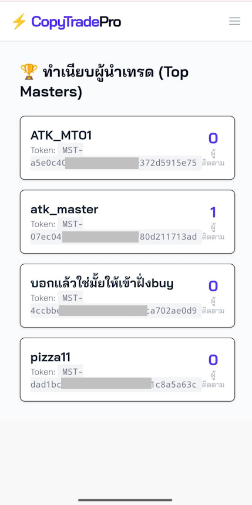
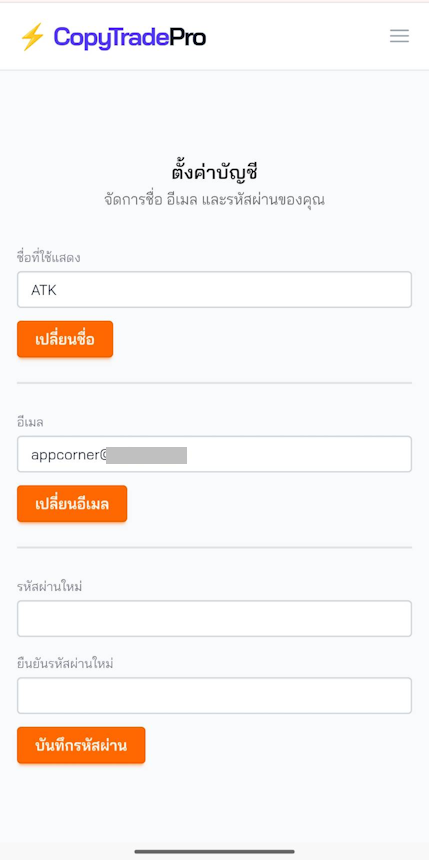

# ⚡ CopyTradePro v7.0.0 (Real-time Copy Trading System)

**CopyTradePro** คือระบบ Copy Trade ประสิทธิภาพสูงที่พัฒนาด้วย **Elixir Phoenix** และ **MQL5** ออกแบบมาเพื่อลดความล่าช้า (Latency) ในการส่งสัญญาณเทรดด้วยการเชื่อมต่อแบบ **TCP Socket** โดยตรง ทำให้สามารถคัดลอกออเดอร์จาก Master ไปยัง Follower ได้ในระดับเสี้ยววินาที


* [System Architechture Diagram](diagram.mmd)

---

## 🚀 ฟีเจอร์หลัก (Key Features)

### 🌟 สำหรับผู้ใช้งาน (User)
* **Multi-Account System:** 1 Login สามารถสร้างได้หลาย Trading Account ทั้ง Master และ Follower แยกพอร์ตจัดการอิสระ
* **3 Copy Modes:**
  * 📡 **PUBSUB** — ส่งสัญญาณเทรดแบบสาธารณะให้ Follower ทุกคนที่ติดตาม
  * 🤝 **1TO1 (Exclusive)** — ก๊อปปี้แบบตัวต่อตัวกับ Partner ที่กำหนด
  * 📝 **RECORD** — บันทึกข้อมูลเทรดเข้า Database เพื่อดูผลงานสถิติ โดยไม่ส่งสัญญาณไปยัง Follower
* **Smart Synchronization:** ระบบตรวจสอบและเคลียร์ออเดอร์ค้าง (Zombie Orders) อัตโนมัติทันทีที่เชื่อมต่อ
* **Emergency Kill Switch:** (เฉพาะโหมด 1TO1) หากฝ่ายใดฝ่ายหนึ่งเกิด Stop Out ระบบจะสั่งปิดออเดอร์ของคู่สัญญาให้ทันที
* **Cumulative Profit Charts:** กราฟกำไรสะสมแบบ Real-time บน Dashboard (Chart.js + LiveView Hooks)
* **Real-time Dashboard:** แสดงผลกำไร, ออเดอร์ที่ถืออยู่, ประวัติการเทรด, และกราฟแบบ Real-time
* **Secure Authentication:** ระบบสมัครสมาชิก/เข้าสู่ระบบที่ปลอดภัย พร้อม Magic Link

### ⚙️ สำหรับระบบหลังบ้าน (System & Admin)
* **TCP Socket Server:** สื่อสารกับ EA (Expert Advisor) ผ่าน TCP Protocol โดยตรง รวดเร็วและเสถียรกว่า HTTP API
* **Failure Handling:** หาก Follower เปิดออเดอร์ไม่ได้ ระบบจะแจ้งกลับให้ Master ปิดออเดอร์นั้นทิ้งทันที (Sync Close)
* **Asynchronous Processing:** ใช้ GenServer ในการจัดการ Connection จำนวนมากพร้อมกัน
* **Database Management:** จัดเก็บข้อมูลออเดอร์และ User ด้วย PostgreSQL

---

## 🛠️ Tech Stack

**Backend & Web:**
* **Elixir:** ภาษาหลักในการประมวลผล (High Concurrency)
* **Phoenix Framework (v1.7+):** Web Framework
* **Phoenix LiveView:** สำหรับทำ Real-time UI
* **Chart.js (v4.4.7):** กราฟกำไรสะสม
* **Ecto:** Database Wrapper
* **PostgreSQL:** ฐานข้อมูลหลัก

**Frontend:**
* **Tailwind CSS (v4):** Styling Framework
* **Font:** Bai Jamjuree (Google Fonts)

**Trading Client:**
* **MQL5:** ภาษาสำหรับเขียน EA บน MetaTrader 5
* **WinSock:** สำหรับการเชื่อมต่อ TCP

---

## 📸 ภาพตัวอย่าง (Screenshots)

| Mobile Menu | Master Board | Settings |
|:---:|:---:|:---:|
|  |  |  |

---

## 📥 การติดตั้งและใช้งาน (Installation)

### 1. ส่วนของ Web Server (Elixir)

สิ่งที่ต้องมี:
* Elixir & Erlang
* PostgreSQL

ขั้นตอนการรัน:
```bash
# 1. Clone โปรเจกต์
git clone https://github.com/appcorner/copy_trade.git
cd copy-trade

# 2. ติดตั้ง Dependencies
mix deps.get

# 3. ตั้งค่า Database (แก้ไข config/dev.exs ให้ตรงกับเครื่องคุณก่อน)
mix ecto.setup

# 4. (ถ้ามีปัญหา Migration) ล้างฐานข้อมูลและลงใหม่
mix ecto.reset

# 5. รัน Server
mix phx.server
```

เปิด Browser ไปที่ `http://localhost:4000`

### 2. ส่วนของ EA (MetaTrader 5)

1. เปิดโปรแกรม **MetaTrader 5**
2. ไปที่ **Tools > Options > Expert Advisors**
   * ✅ เช็คถูกที่ **Allow DLL imports** (สำคัญมาก! เพื่อใช้ Socket)
3. นำไฟล์ EA ไปวางในโฟลเดอร์ `MQL5/Experts/`
   * `MasterSender_V3_TCP.ex5` (สำหรับ Master)
   * `SlaveTCP_V5.ex5` (สำหรับ Follower)
4. สมัครสมาชิกหน้าเว็บ แล้วสร้าง Trading Account เพื่อรับ **API Key** และ **Master Token**
5. นำ Key ไปใส่ในช่อง Input ของ EA

#### *** ข้อมูลการ รับ-ส่ง TCP ระหว่าง Server กับ EA ***

* [TCP Message Specification (Text/Pipe Format)](tcp_spec.md)
* [TCP Sequence Diagram](tcp_sequence.mmd)

---

## 🔄 หลักการทำงาน (Workflow)

1. **Register & Create Account**: สมัครสมาชิก → สร้าง Trading Account (เลือก Master หรือ Follower) → ระบบสร้าง API Key อัตโนมัติ
2. **Connection & Sync**: เมื่อ EA เชื่อมต่อด้วย API Key จะส่ง Snapshot ของออเดอร์ให้ Server ตรวจสอบ
3. **Signal Transmission**:
   * **Master EA** ส่งข้อมูลการเปิดออเดอร์ผ่าน TCP
   * **Elixir Server** ตรวจสอบโหมด (PUBSUB/1TO1/RECORD) แล้วดำเนินการตาม mode
   * **RECORD mode:** บันทึกลง DB เฉยๆ ไม่ส่งสัญญาณ
4. **Execution & Ack**:
   * **Follower EA** รับคำสั่งแล้วเปิดออเดอร์ -> ส่งผลลัพธ์ (ACK) กลับ
   * **Failure Case:** หากเปิดไม่ได้ Server จะสั่งให้ Master ปิดออเดอร์ (เฉพาะ 1TO1)
5. **Dashboard Update**: Web Dashboard (LiveView) + กราฟกำไรสะสม อัปเดตแบบ Real-time

---

## 📂 โครงสร้างโปรเจกต์ (Project Structure)

```text
lib/
├── copy_trade/
│   ├── accounts/
│   │   ├── user.ex              # User schema (login only)
│   │   ├── trading_account.ex   # Trading account schema (role, api_key, copy_mode)
│   │   └── scope.ex             # Authorization scope
│   ├── master_trade.ex          # Master trade signal schema
│   ├── trade_pair.ex            # Follower trade pair schema
│   ├── trade_pair_context.ex    # Business logic for trades
│   ├── trade_signal_router.ex   # Signal routing (PUBSUB/1TO1/RECORD)
│   ├── tcp_server.ex            # TCP Connection handler (GenServer)
│   └── accounts.ex              # Accounts context
├── copy_trade_web/
│   ├── live/
│   │   ├── dashboard_live.ex    # Dashboard (Master/Follower views + charts)
│   │   ├── account_live/        # Account CRUD (index, new)
│   │   └── user_live/           # User settings, registration, login
│   ├── components/
│   │   └── layouts/
│   │       ├── menu.html.heex   # Main app layout with nav + footer
│   │       └── root.html.heex   # Landing page layout
│   └── controllers/
│       ├── api/                 # API controllers (webhook, follower)
│       └── page_html/           # Landing page templates
priv/
├── repo/migrations/             # Database migrations
└── static/                      # Static assets
assets/
└── js/app.js                    # LiveView hooks (Chart.js integration)
```

---

## 🗄️ Database Schema (v7.0.0)

### Users (`users`)
เก็บเฉพาะข้อมูลการเข้าสู่ระบบ
- `id`, `email`, `hashed_password`, `name`

### Trading Accounts (`trading_accounts`)
เก็บข้อมูลพอร์ตแต่ละพอร์ต (1 User มีได้หลายพอร์ต)
- `id`, `user_id` (FK → users)
- `name` (ชื่อพอร์ต)
- `role` (master / follower)
- `api_key` (Unique, auto-generated)
- `master_token` (Unique, auto-generated for Master)
- `copy_mode` (PUBSUB / 1TO1 / RECORD)
- `partner_id`, `following_id` (self-referencing FK)
- `is_active` (boolean)

### Master Trades (`master_trades`)
เก็บ Signal ต้นฉบับจาก Master
- `ticket`, `symbol`, `type`, `price`, `volume`, `sl`, `tp`, `status`

### Trade Pairs (`trade_pairs`)
เก็บข้อมูลการคัดลอกของ Follower
- `master_trade_id` (FK → master_trades)
- `account_id` (FK → trading_accounts)
- `slave_ticket`, `slave_volume`, `status`, `profit`

---

## 🚧 ปัญหาที่พบบ่อย (Troubleshooting)

**Q: หน้าเว็บขึ้น Pending Migration Error?**
A: ให้หยุด Server แล้วรันคำสั่ง:

```bash
mix ecto.migrate
# หรือถ้ายังไม่หายให้ล้างใหม่ด้วย
mix ecto.reset
```

#### กรณีพิเศษ: ถ้ายังไม่หาย ให้ทำตาม 4 ขั้นตอนนี้ (Nuclear Option) ☢️

**ขั้นตอนที่ 1:** ปิด Server (`Ctrl+C`) แล้วลบโฟลเดอร์ `_build` ทิ้ง

**ขั้นตอนที่ 2:** เช็คใน `priv/repo/migrations/` ว่ามีไฟล์ชื่อซ้ำหรือไม่

**ขั้นตอนที่ 3:** ล้าง Database แบบหมดจด
```powershell
mix deps.get
mix ecto.drop
mix ecto.create
mix ecto.migrate
```

**ขั้นตอนที่ 4:** รัน Server ใหม่
```powershell
mix phx.server
```

**Q: EA เชื่อมต่อไม่ได้ (Connection Failed)?**
A: ตรวจสอบว่าเปิด **Allow DLL imports** ใน MT5 หรือยัง และตรวจสอบว่า Server รันอยู่ที่ Port `5001` (TCP) หรือไม่

---

## 📝 Changelog

### v7.0.0 (2026-02-18)
- ✨ Multi-Account System (1 User = หลาย Trading Account)
- ✨ RECORD mode สำหรับ Master (บันทึกผลงานอย่างเดียว ไม่ส่งสัญญาณ)
- ✨ Mode Switcher UI บน Master Dashboard (PUBSUB/1TO1/RECORD)
- ✨ กราฟกำไรสะสม (Cumulative Profit Chart) ด้วย Chart.js
- ✨ แสดง API Keys ในหน้า Settings
- ✨ Role card selector UI ในหน้าสร้างบัญชี
- 🔧 Mobile menu: เพิ่มลิงก์ Masters, auto-close เมื่อ navigate
- 🔧 Footer รวมเป็นที่เดียว พร้อม version badge
- 🔧 ลดขนาด font mobile สำหรับหน้าจอเล็ก

### v6.2.0
- ระบบ Copy Trade พื้นฐาน (1TO1/PUBSUB)
- TCP Socket Server + EA communication
- Dashboard (Master/Follower views)
- User authentication (Magic Link)

---

## 📝 ลิขสิทธิ์ (License)

โปรเจคนี้เผยแพร่ภายใต้ลิขสิทธิ์แบบ [MIT License](LICENSE).
